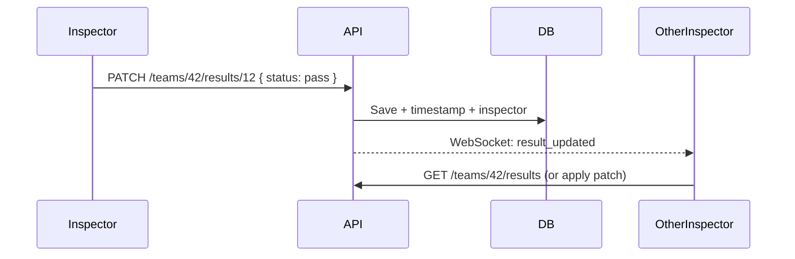

# Backend & real-time sync (planned)

## Why localStorage is not enough

The current app saves inspections and teams in each browser’s **localStorage**. That works for one person on one device, but it cannot:

- Share pass/fail and comments between inspectors
- Show live status on an organizer dashboard
- Avoid two inspectors overwriting each other on the same car/item

For June, you need a **shared backend** that all tablets/phones talk to over Wi‑Fi (or the internet).

## What you described

| Need | Meaning |
|------|--------|
| **Shared data** | One source of truth for teams, checklist, and every inspection result |
| **Several inspectors** | Many users logged in at once |
| **Several vehicles** | Each team/car has its own tech form state |
| **Real-time status** | When Inspector A marks item 12 Pass, Inspector B and organizers see it within seconds |
| **Syncing** | No “refresh to see updates”; conflicts handled safely |

## Recommended data model (high level)

```
Competition
  └── Team (car number, team name)
        └── InspectionResult (per checklist item)
              - inspectionId (links to master checklist)
              - status: pending | pass | fail
              - comment
              - inspectorId, inspectorName
              - updatedAt

Master checklist (from CSV / admin)
  - id, title, description, competition, station
```

Important rule: **results are per team + inspection item**, not global. Inspector filters by team; dashboard aggregates all teams.

## Real-time sync — common approaches

### Option A — **Supabase** (good fit for a small team / fast demo)

- PostgreSQL database + REST API + **Realtime** subscriptions (WebSockets)
- Auth (email magic link or simple password per inspector)
- Row Level Security so teams only see what they should (optional at first)
- Frontend: when pass/fail is saved → `UPDATE` row → all clients subscribed to that team’s results get the event

**Pros:** Less server code, hosted, quick to ship  
**Cons:** Needs internet (or hotspot); learn their dashboard

### Option B — **Custom API + WebSockets** (Node or Python on a laptop at tech)

- Run API on a machine on the **competition LAN** (e.g. `http://192.168.x.x:3000`)
- REST for reads/writes; **Socket.io** or similar to broadcast `inspection:updated` events
- SQLite or PostgreSQL on the same machine

**Pros:** Works offline at track if only local Wi‑Fi; full control  
**Cons:** You operate the server during comp; more code

### Option C — **Firebase Firestore**

- Document per `teams/{teamId}/results/{inspectionId}`
- Real-time listeners built in

**Pros:** Very fast to add live UI  
**Cons:** NoSQL modeling; vendor lock-in

For FSAE tech with a June deadline, **Supabase (A)** or **local Node + SQLite + Socket.io (B)** are the most practical.

## Suggested flow (inspector app)



1. Page loads → fetch checklist + team list + **this team’s results**
2. Pass/Fail → **write to API immediately** (optimistic UI optional)
3. Subscribe to **team channel** (or competition channel) for live updates
4. Dashboard subscribes to **all teams** (or summary endpoint)

## Conflict handling (simple rules)

- **Same item, two inspectors:** Last write wins, but store `updatedAt` + `inspectorId` so organizers see who changed it last.
- **Optional later:** Show “Updated by X at 10:42” on each row.
- **Stricter:** Lock item when one inspector opens it (usually overkill for tech).

## Phased build (recommended order)

| Phase | Deliverable |
|-------|-------------|
| **1** | REST API: teams, checklist, save/get results per team (no realtime yet) |
| **2** | Inspector app calls API instead of localStorage |
| **3** | WebSocket / Supabase Realtime — live updates on inspector + dashboard |
| **4** | Login (inspector vs organizer vs team read-only) |
| **5** | Dashboard: all teams, % complete, failed items |
| **6** | PDF export from API data |

Phases 1–3 are what unlock “several inspectors, several cars, live status.”

## Network at competition

- Prefer a **dedicated Wi‑Fi router** or site LAN with the API server on a laptop
- Tablets use `http://<server-ip>/` — not `localhost`
- Test with 2–3 phones before comp day
- Have a **fallback** (export JSON / last-known CSV) if Wi‑Fi fails

## What stays from the current app

- UI you built (filters, pass/fail, comments, admin)
- `data-store.js` becomes a thin **API client** (`api.getTeams()`, `api.saveResult()`, `api.subscribe(teamId, callback)`)
- Admin page writes to API instead of localStorage
- CSV import becomes a one-time **seed** endpoint or admin action

## Next decision for you

1. **Hosted (Supabase)** vs **on-site server (Node + SQLite)** at Michigan  
2. Whether **login** is required day one or a shared inspector password is OK for demo  

Once you pick that, the next implementation step is **Phase 1 API** + swapping the inspector save path from localStorage to HTTP.
